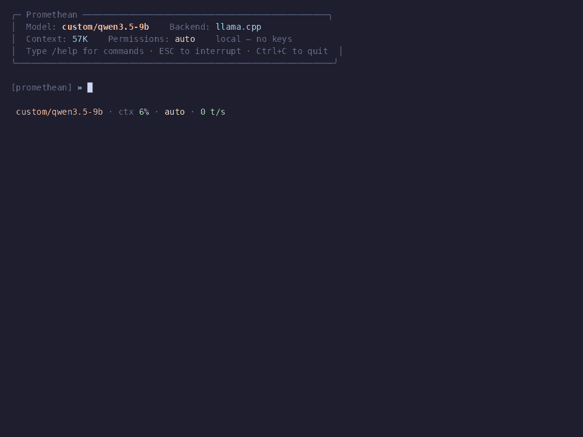

<div align="center">


# PROMETHEAN

**Locally sourced.**

Full-stack coding agent for hardware you already own.

`224k context` · `deep research` · `autonomous agents` · `8 GB of VRAM`

[](pyproject.toml)
[](https://github.com/alexhergomz/Promethean/actions/workflows/ci.yml)
[](LICENSE)
[](tests/)
[](https://huggingface.co/Qwen)
[](#target-hardware)

*by Minerva Labs*

</div>

<p align="center"></p>

<p align="center"><sub>More demos in <a href="docs/"><code>docs/</code></a></sub></p>

---

## What is this

A self-contained coding & research agent. In its flagship mode it runs **entirely on your machine**, on a single 8 GB consumer GPU: no API keys, no metering, no request leaves the box. The 8 GB figure is what the local inference stack is tuned for, not an entry requirement. The harness speaks plain OpenAI-compatible HTTP, so the same agent also drives any other OpenAI-compatible server (Ollama, LM Studio, vLLM) on whatever hardware you have (see [Bring your own model](#bring-your-own-model)).

It's a fork of [cheetahclaws] (a Python-native, Claude-Code-style harness) wired onto two upstream `llama.cpp` research forks for the inference layer. Three layers, one binary:

| Layer | Source | What it does |
|---|---|---|
| **TurboQuant** *(TQ)* | [TheTom/llama-cpp-turboquant] | Q4_0/Q4_0 KV-cache quantization with FlashAttention. Cuts KV VRAM 4×; fits **224 K context** on 8 GB. |
| **TriAttention** *(Tria)* | [Mao et al., 2026][tria-paper] · C/HIP impl by [domvox/triattention-ggml] | Eviction-based KV pruning (budget / window / sink / interval). Bounds *active* KV regardless of conversation length. |
| **Harness** | this repo, forked from [cheetahclaws] | Tool dispatch, sandboxed research agents, symbol-graph navigation, slot save/restore, truncation recovery, live UX. **Without it, it's just a chat endpoint.** |

The two `llama.cpp` forks merge in [domvox/llama.cpp-turboquant-hip] on `feature/triattention-scoring`, the actual binary you run.

> Every capability the cloud sells by the token, Promethean runs locally for free.

[cheetahclaws]: https://github.com/SafeRL-Lab/cheetahclaws
[TheTom/llama-cpp-turboquant]: https://github.com/TheTom/llama-cpp-turboquant
[domvox/triattention-ggml]: https://github.com/domvox/triattention-ggml
[domvox/llama.cpp-turboquant-hip]: https://github.com/domvox/llama.cpp-turboquant-hip
[tria-paper]: https://arxiv.org/abs/2604.04921

---

## Quick start

```bash
git clone https://github.com/alexhergomz/Promethean.git
cd promethean
pipx install .             # global `promethean` command, runnable from any directory
                           # (or `pip install -e .` inside a venv for development)
                           # add [graph] for symbol-graph nav, [all] for everything
```

**Fastest start: a server you already run.** No GPU and no inference build required; point Promethean at any OpenAI-compatible endpoint — llama-server, or an Ollama / LM Studio / vLLM server exposing the OpenAI API:

```bash
/config custom_base_url=http://127.0.0.1:8080/v1   # in the REPL
promethean -m custom/qwen3.5-9b                     # any model the server has loaded
```

**Full local stack** (the headline mode: 224 K context on an 8 GB GPU):

```bash
# Build the inference server once. See the companion llama.cpp fork (domvox/llama.cpp-turboquant-hip),
# branch: feature/turboquant-kv-cache  (or feature/triattention-scoring)

# One-time: point Promethean at the model to serve. It then starts
# llama-server for you whenever the agent runs and the server is down.
#   in the REPL:  /config llama_model_path=/path/to/model.gguf
promethean                 # interactive REPL (auto-starts local llama-server if down)
```

Everyday flags, same in either mode:

```bash
promethean -p "refactor the auth module"   # one-shot, non-interactive
promethean --tria                          # long-context speedup via TriAttention
promethean --accept-all                    # autonomous: never ask permission
promethean --web                           # browser terminal
```

### Bring your own model

Promethean targets a single backend: **llama.cpp (llama-server) over the OpenAI-compatible protocol**, exposed as the `custom` provider. Supporting one transport instead of a dozen hosted APIs is a deliberate choice — it keeps the harness small, keys out of the loop, and every request on your own machine. Because the protocol is the OpenAI standard, the same `custom` path also drives any other OpenAI-compatible server you run (Ollama's `/v1`, LM Studio, vLLM, etc.).

```bash
# Point at your server (defaults to the local llama-server loopback):
/config custom_base_url=http://127.0.0.1:8080/v1
/model custom/qwen3.5-9b
```

Switch models any time with `/model custom/<name>` in the REPL or `-m` on the CLI; `/model recommend` sizes a local GGUF to your hardware. Named profiles (`/model qwen`) bundle model and base URL into one alias. If you want a hosted model, run it behind an OpenAI-compatible proxy and point `custom_base_url` at that.

**Tool calling with local models.** An agent needs the model to emit tool calls, and small local models are inconsistent about the wire format. Two things make this robust:

- For `llama-server`, the model's chat template must be applied so it can emit native `tool_calls` — pass `--jinja`. Promethean's auto-started server includes it by default (`_DEFAULT_ARGS` in `server_autostart.py`); if you launch `llama-server` yourself, add `--jinja` (and set your own args via `/config llama_server_args=…`).
- Many models still write the call as JSON or XML in the message *text* instead of the native field. Promethean recovers those automatically (`providers._recover_text_tool_calls`) and dispatches them, so the agent doesn't silently no-op. If a model emits a call for a tool that doesn't exist, you get a visible warning instead of nothing. Toggle with `/config recover_text_tool_calls=false`.

**Edits that survive a weak model.** Small models miss an exact `Edit` target more often than frontier models do, and a strict match sends them into a retry loop. Two guards keep the loop short:

- When `old_string` has no verbatim match, Edit tries to recover a *unique* target: it strips `Read` line-number gutters, ignores indentation, then falls back to a high-similarity block match. It only ever applies a single unambiguous span and annotates the diff so the change stays reviewable; ambiguous matches are rejected with a hint to add context. Toggle with `/config fuzzy_edit=false`.
- After a successful `Edit`/`Write` on a source file, the file's checker runs (pyright/mypy/flake8/py_compile for Python, shellcheck/bash for shell) and any problems are appended to the tool result, so the model can fix its own break on the same turn instead of moving on. Silent when the file is clean or no checker is installed. Toggle with `/config verify_after_edit=false`.

New here? [`docs/MODELS.md`](docs/MODELS.md) is the practical guide to picking, downloading, and wiring up a model (local GGUF via llama-server, or any OpenAI-compatible server). Project context is read from `AGENTS.md` and `CLAUDE.md` (project and `~/.claude/`); `/init` writes a starter one pre-filled from a scan of the repo.

---

## At a glance

```
┌──────────────────────────────────────────────────────────────┐
│  HARNESS  (Python; ~45 KLoC; 916 unit tests)                 │
│  REPL · slash commands · permission flow · tool dispatch     │
│  symbol-graph nav · rabbit-hole research · live UX           │
│  truncation recovery · bash deny-list · sensitive-path jail  │
└──────────────────────────────────────────────────────────────┘
                       │   OpenAI-compat HTTP
                       ▼
┌──────────────────────────────────────────────────────────────┐
│  INFERENCE  (patched llama.cpp · ROCm/HIP/CPU)               │
│  TurboQuant Q4_0/Q4_0 KV  +  FlashAttention                  │
│  TriAttention eviction (budget/window/sink/interval)         │
│  Slot save/restore for context paging                        │
└──────────────────────────────────────────────────────────────┘
                       │   GGUF
                       ▼
┌──────────────────────────────────────────────────────────────┐
│  MODEL  (Qwen3.5-9B GGUF · llama.cpp Q4_0 quantization)      │
│  ~5 GB on disk · 224 K context after TurboQuant              │
└──────────────────────────────────────────────────────────────┘
```

---

## Status

| Layer | Done | Open |
|---|---|---|
| **TurboQuant** | Q4_0/Q4_0 KV + FlashAttention stable on `feature/turboquant-kv-cache` | merging the two `llama.cpp` branches into one |
| **TriAttention** | eviction wired end-to-end; auto-calibration on NVIDIA + AMD; **28.4 t/s** vs 23.8 t/s dense at 4 K | runtime flag in the unified build |
| **Harness** | 916 tests · slot save/restore · sandboxed research · symbol-graph nav · `/resume` · MCP · `/slots` | provider cassettes · Rust/Go symbol-graph fixtures |

> **Research project, not production software.** Run it on your own machine, at your own risk.

---

## Target hardware

This table is what the fully local stack (TurboQuant + Qwen3.5-9B) is tuned for. None of it is required otherwise: with an existing OpenAI-compatible server (llama-server, Ollama, LM Studio, vLLM), any machine that runs Python is enough.

| Component | Spec |
|---|---|
| **GPU** | 8 GB VRAM (developed on an RX 6650 XT, RDNA 2 / `gfx1032`, ROCm 6.2) |
| **CPU** | Any x86-64 (CPU-only path works, just slower) |
| **RAM** | 16 GB recommended |
| **Disk** | ~10 GB for model + workspaces |

Built on a Ryzen 5, a 6650 XT, and the conviction that intelligence shouldn't require a subscription.

---

## Why this exists

Running an autonomous coding agent locally is two problems stacked:

1. **Memory.** A 9 B model's KV cache grows as `2 × n_layer × n_head × d_head × ctx × 2` bytes, about 1 GB per 16 K context on Qwen3.5-9B. Standard Q4_0 weights fit in ~5 GB, but the KV cache pushes you off an 8 GB card at long contexts. Offload is too slow for an agent loop.
2. **Agent quality.** A chat endpoint isn't an agent. You need tool dispatch, permission flow, truncation recovery, persistent sessions, and enough live UX to know what the model is doing. None of that ships in `llama-server`.

Promethean's three layers answer each:

- **TurboQuant** cuts KV from ~1 GB / 16 K → ~250 MB / 16 K, wired straight into the FlashAttention kernel. Fits **224 K context** on 8 GB.
- **TriAttention** bounds *active* KV at a configurable budget, so going past Qwen3.5's 32 K training context doesn't degrade attention linearly.
- **The harness** is the [cheetahclaws] fork with the fixes that make local autonomous use viable, the most load-bearing being the truncation alternation invariant fix (the bug behind the "harness repeats text" / "Qwen tool-call spam" failure modes).

---

## Features

### Symbol-graph navigation
Eight tools backed by tree-sitter + a sqlite tag cache (vendored from [Aider's repo map](https://aider.chat/docs/repomap.html)):

- `RepoMap` · `FindSymbol` · `GetCallers` · `Outline`
- `Neighborhood`: callers + callees of a symbol
- `PathBetween`: bidirectional BFS, shortest call chain
- `Imports`: transitive `depth=N` import graph
- `SearchFiles`: **BM25** with identifier-aware tokenization (camelCase / snake_case / acronym splits) and a path bonus

All cache by `(root, mtime-fingerprint)` → ~160× speedup on repeats. `/graph-view on` renders the active call chain as a Rich-drawn boxed graph, traversed path lit in flame. *(Install the `[graph]` extra to enable.)*

### Rabbit-hole mode: research that doesn't bill by the hour

```
/rabbit-hole investigate every variant of speculative decoding
             with hybrid SSM+attention architectures
```

Spawns a **sandboxed agent** that runs in the background until killed:
- Tool whitelist excludes Bash/Write/Edit; `Read` is path-jailed to its workspace
- Disk-backed workspace at `~/.promethean/rabbit-hole/<id>/`: fetched sources (deduped by URL hash), structured findings, sub-question tree
- Live activity feed via `/rabbit-hole status`, a chronological event log
- **Resumable**: `/rabbit-hole resume <id>` continues where it left off
- BM25-driven final synthesis on cancel/finish

```
/rabbit-hole <question>            spawn          /rabbit-hole status <name>   detail + feed
/rabbit-hole list [--all]          workspaces      /rabbit-hole stop <name|all> kill (synth runs)
/rabbit-hole resume <id> [hint]    resume          /rabbit-hole report <name>   latest synthesis
```
Aliases: `/rh`, `/rabbithole`.

### Sub-agents
Spawn as many as the problem needs. They're on your hardware: own context, sandboxed tool whitelist, no per-agent invoice.

### Slot configuration (`/slots`)
Three modes for the inference layer, switchable from the REPL:

| Configuration | `np` | `auto_slot_swap` | Use case |
|---|---|---|---|
| **Single context, serial** *(default)* | 1 | on | Full 224 K for everyone. Subagent saves+restores parent's KV. |
| **Multi parallel** | 4 | off | 4×57 K parallel slots, true concurrency. |
| **Multi serial** | 4 | on | 4 slots + queueing for >4 agents. Slow but unbounded. |

### Security guards
Multi-layer defenses:
- `_is_dangerous_bash`: regex deny-list for `rm -rf /`, `dd of=/dev/sda`, fork bomb, `curl | sh`, `chmod 777 /`, etc. Fires *even in `accept-all` mode*.
- `_is_sensitive_path`: `~/.ssh`, `~/.aws`, `~/.gnupg`, `/etc/shadow` blocked unconditionally for Read/Write/Edit.
- Tool-whitelist enforcement for subagents: schema filter + dispatch reject (defense in depth).

> A guardrail against confused models, **not** a hardened sandbox. Run untrusted models in a container.

### Persistence & live UX
- `/resume`, `/save`, `/load`: session resume with SQLite + FTS5
- MCP server support (`cc_mcp/`); pip-installable console entry point
- Bash output streams line-by-line; new-file writes return a unified-diff preview
- Context-survival memory near compaction, named model profiles, reversible `/undo`
- **ESC** aborts an in-flight turn cleanly and keeps the session (TTY only); Ctrl+C still works too
- **Tab** completes slash commands and file paths in the input line; Shift+Tab cycles the permission mode

### Truncation alternation fix
The load-bearing harness fix. When `max_tokens` truncates mid-tool-call, the old path popped the empty assistant turn, breaking OpenAI-compat user/assistant alternation and causing Qwen 9B to spam tool calls / other models to repeat prior text. Now replaced with a `[output cut off at max_tokens]` stub that preserves alternation.

---

## Development

```bash
python -m pytest tests/ -x -q                # full suite
python -m pytest tests/test_rabbit_hole.py   # one module
ruff check .                                 # lint (optional)
```

Config and state live in `~/.promethean/` (migrated automatically from a pre-rebrand `~/.cheetahclaws/` on first run). See [CONTRIBUTING.md](CONTRIBUTING.md) for layout and the PR checklist.

---

## License

This repo: **MIT**. See [LICENSE](LICENSE).

Upstream license summary (always check upstream for the authoritative version):
- **[cheetahclaws]**: MIT. The harness foundation; this repo is a fork.
- **[TheTom/llama-cpp-turboquant]**: MIT (inherits from `llama.cpp`). TurboQuant KV-quantization fork.
- **[domvox/triattention-ggml]**: see upstream `LICENSE`. Independent C/HIP TriAttention implementation.
- **[domvox/llama.cpp-turboquant-hip]**: MIT (inherits from `llama.cpp`). The combined runtime binary.
- **[Aider's `repomap.py`](https://github.com/Aider-AI/aider)**: Apache 2.0. Vendored under `agent_tools/repomap.py`.

The TriAttention method is described in **Mao et al., 2026** ([arXiv:2604.04921][tria-paper]).

---

## Credits

The two load-bearing inference contributions are **upstream work** integrated here, not invented here:

- **TurboQuant**: Q4_0/Q4_0 KV-cache quantization with FlashAttention. Source: [TheTom/llama-cpp-turboquant], the upstream `llama.cpp` fork used as the base.
- **TriAttention**: eviction-based KV pruning that scores cached KV by trigonometric frequency prediction. Paper: Mao et al., 2026 ([arXiv:2604.04921][tria-paper]); independent C/HIP impl: [domvox/triattention-ggml] (calibration pipeline, runtime kernel, TRIA v2 stats format).
- **Combined fork** merging both into one binary: [domvox/llama.cpp-turboquant-hip] on `feature/triattention-scoring`.

**Foundations**
- **[Qwen team](https://huggingface.co/Qwen)**: the [Qwen3.5-9B](https://huggingface.co/Qwen) model. The agent is unusable without a capable mid-tier model; Qwen3.5 is the reason this works on consumer hardware.
- **[ggml-org](https://github.com/ggml-org/llama.cpp)**: `llama.cpp`. Both inference forks branch off its mainline.
- **[SafeRL-Lab/cheetahclaws](https://github.com/SafeRL-Lab/cheetahclaws)**: the Python harness this repo is forked from. ~40 KLoC of Claude-Code-style scaffolding (REPL, slash commands, tool registry, providers, MCP, session resume) built on top of.

**Patterns borrowed**
- **Aider**: vendored [`repomap.py`](https://aider.chat/docs/repomap.html) for symbol-graph navigation (tree-sitter + PageRank).
- **Anthropic**: the [`think` tool](https://www.anthropic.com/news/claude-think-tool) pattern.
- **[SWE-agent](https://github.com/SWE-agent/SWE-agent)**: agent-computer-interface design and the history-processor pattern.
- **[OpenHands](https://github.com/All-Hands-AI/OpenHands)**: context-condenser pattern.
- **[Cline](https://github.com/cline/cline)**: `FileContextTracker` (mtime + turn tagging on Read).

[SafeRL-Lab/cheetahclaws]: https://github.com/SafeRL-Lab/cheetahclaws

---

<div align="center">

*No keys required. Run it yourself.*

[Issues](https://github.com/alexhergomz/Promethean/issues) ·
[CONTRIBUTING](CONTRIBUTING.md) ·
[Architecture](docs/architecture.md)

</div>
